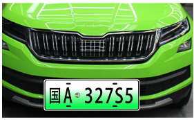
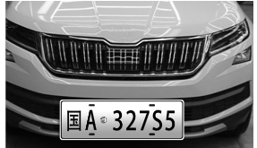
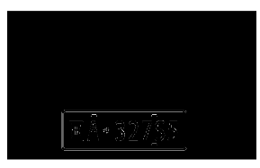
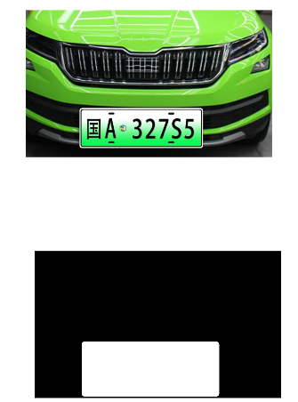

# 0628

## 1、新增自动驾驶界面

1、新增自动驾驶界面RightAutoFragment，并与底部菜单栏滑动绑定。

2、通过LeftFragment获取图像，并传送到RightAutoFragment.java。

3、工程结构Utils中新增TrafficRecUtile，新增类ColorRecognition及接口PicColorRecResultCallback。

4、新增MyApplication，用以获取Application Context，是否成功获取不清楚，程序闪退。

# 0629

## -尝试引入opencv，不顺利

## 1、下载opencv


## 2、Android Studio的配置


## 3、在项目中导入opencv

### 3.1  导入OpenCV库


### 3.2Android SDK和Gradle配置

展开项目列表，打开app的build.gradle文件，确定gradle版本号和Android SDK版本号。


记住app的compileSdkVersion、minSdkVersion、targetSdkVersion版本号的值
切换到OpenCV的build.gradle 更改相应的版本号。再Sync Now


### 3.3 添加module dependency

之前我们已经把OpenCV作为一个module导入了project。接下来为project添加module dependency，使我们的Android项目可以识别OpenCV。点击File—>Project structure…。在弹出的对话框的左边栏选择Dependcies。在中间的Modules中选择app。在右边的declared Dependcies中选择+号，在下来选项中选择第三项Module dependency。


在弹出的对话框中把OpenCV选中，这个SDK就是我们之前导入的OpenCV SDK。这一步是添加依赖。

### 3.4添加jniLibs

找到刚才建立的项目的路径，路径为“xx\app\src\main”进入到main文件夹下，然后新建一个文件夹名为“jniLibs”

进入到opencv-3.4.3-android-sdk\OpenCV-android-sdk\sdk\native\libs文件夹中，将armeabi-v7a这个文件夹复制到刚才的jniLibs文件夹中。


之后在项目的build.gradle下添加以下代码：


下面是教程原文：


### 3.5OpenCV库的加载

可编写一个子函数在程序开始的时候加载OpenCV库。

## 结果：未成功加载


# 0630

## 1、利用定时器及lhander，自动定时刷新红绿灯识别结果。

涉及定时器函数及Handler的使用:

### 1.1 Handler

```java
    public Handler handler = new Handler() {
        @Override
        public void handleMessage(@NonNull Message msg) {
            if (msg.what == 1) {
//                if (TrfficFlag) {
                    traffic_light();//在这里运行会闪退，从其他类中调用这个函数也会闪退
                    show_news.setText(result + "");
//                    TrfficFlag=false;
//                }
            }
            super.handleMessage(msg);
        }
    };
```

### 1.2 定时器

```java
public void task(){
    Timer timer = new Timer();
    timer.schedule(new TimerTask(){
        @Override
        public void run(){
            Message message = new Message();
            handler.sendMessage(message);
            if (TrfficFlag) {
                message.what = 1;
//                cancel();
            }
        }
    },0,500);//定时器 一秒执行一次
}
```

# 0701

## 1、完善红绿灯识别界面功能

1.1增加识别结果展示，后期二维码识别及解码结果都可以展示在这里，方便调试。


## 2、增加二维码识别功能

2.1在RightAutoFragment界面增加二维码识别模块

```java
  public static String result_qr;
    private Bitmap qrBitmap;
    private boolean qrRecState = false;
    // 二维码、车牌处理
    @SuppressLint("HandlerLeak")
    Handler qrHandler = new Handler() {
        public void handleMessage(Message msg) {
            switch (msg.what) {
                case 10:
                    qrRecState = true;
                    qrBitmap = LeftFragment.bitmap2;
                    if (qrBitmap != null){
                        QRRecon();
                    }else toastUtil.ShowToast("没有连接到摄像头，请连接到摄像头后再试！");
                    break;
                case 20:
//                    toastUtil.ShowToast(result_qr);
                    break;
                case 30:
                    toastUtil.ShowToast("未检测到二维码！");
                    break;
                case 40:
//                    autoDriveAction();
                    break;
                default:
                    break;
            }
        }
    };

    private void QRRecon(){
        new Thread(() -> {
            Result result;
            QR_Recognition rSource = new QR_Recognition(
                    bitmap2Gray(qrBitmap));
            try {
                BinaryBitmap binaryBitmap = new BinaryBitmap(
                        new HybridBinarizer(rSource));
                Map<DecodeHintType, String> hint = new HashMap<DecodeHintType, String>();
                hint.put(DecodeHintType.CHARACTER_SET, "utf-8");
                QRCodeReader reader = new QRCodeReader();
                result = reader.decode(binaryBitmap, hint);
                if (result.toString() != null) {
                    result_qr = result.toString();
                    qrHandler.sendEmptyMessage(20);
                }
                System.out.println("正在识别");
            } catch (NotFoundException e) {
                e.printStackTrace();
                qrHandler.sendEmptyMessage(30);
            } catch (ChecksumException e) {
                e.printStackTrace();
            } catch (FormatException e) {
                e.printStackTrace();
            }
            qrRecState = false;
        }).start();
    }

    /**
     * 图像灰度化
     * @param bmSrc
     * @return
     */
    public Bitmap bitmap2Gray(Bitmap bmSrc) {
        // 得到图片的长和宽
        if (bmSrc == null)
            return null;
        int width = bmSrc.getWidth();
        int height = bmSrc.getHeight();
        // 创建目标灰度图像
        Bitmap bmpGray = null;
        bmpGray = Bitmap.createBitmap(width, height, Bitmap.Config.RGB_565);
        // 创建画布
        Canvas c = new Canvas(bmpGray);
        Paint paint = new Paint();
        ColorMatrix cm = new ColorMatrix();
        cm.setSaturation(0);
        ColorMatrixColorFilter f = new ColorMatrixColorFilter(cm);
        paint.setColorFilter(f);
        c.drawBitmap(bmSrc, 0, 0, paint);
        return bmpGray;
    }
```

2.2 handlar中运行二维码识别模块，通过定时器识别出现的二维码，并且显示

```java
public Handler handler = new Handler() {
    @Override
    public void handleMessage(@NonNull Message msg) {
        if (msg.what == 1) {
                traffic_light();
                qrHandler.sendEmptyMessage(10);
                result = Color_Recognition.onSuccess;
                result2 = ConnectTransport.rec_result+","+ConnectTransport.qr_result;
                show_news.setText(result+","+result_qr);
                rec_result.setText(result2);
        }
        super.handleMessage(msg);
    }
};
```

2.3 connectTransport中增加识别结果保存功能。

```java
public static String qr_result = "识别中……";
private void erweima() {
    RightAutoFragment = new RightAutoFragment();
    yanchi(1000);
    qr_result=RightAutoFragment.result_qr;
}
```

2.4 此时识别的结果为string，构造函数将字符串转化为byte[]和char[]，后期与小车交互可选取对应格式。

```java
public static String qr_result = "识别中……";
public static byte[] qr_resultByt;
public static char[] qr_resultArr;
private void erweima() {
    RightAutoFragment = new RightAutoFragment();
    yanchi(1000);
    qr_result=RightAutoFragment.result_qr;
    qr_resultByt=qr_result.getBytes();//字符串照转字节
    qr_resultArr=qr_result.toCharArray();//字符串照转数组

}
```

```java
case 2://二维码识别
    msg.what=2;
    show_result_handler.sendMessage(msg);
    
    MAJOR = 0xA0;
    FIRST = qr_resultByt[0];//二维码读取到的数据，字符串转为了BYTE，此处将第一位发给小车
    SECOND = 0x00;
    THRID = 0x00;
    send();
    mark=0;
    break;
```

## 3、遗留问题

自动运行后，再次点击自动运行按钮会闪退。


# 0702-0705

## 1、增加car_color及car_shape，形状及颜色识别代码增加。

### 1.1将形状及颜色识别模块代码引入app。

将两个功能代码合并到RightAutoFragment中，

### 1.2  颜色识别模块代码如下：

```java
/**
     * 颜色识别
     */

    private void CarColor() {
        Bitmap bitmap_color = LeftFragment.bitmap;//跨页面获取位图
        if (bitmap_color != null) {
            convertToBlack_Col(bitmap_color);// 像素处理背景变为白色，红、绿、蓝、黄、品、青、黑色，白色不变
        }
    }

    private int[] colorNum = new int[8];//红、绿、蓝、黄、品、青、黑色个数
    private int blackMax = 255; //黑色最大RGB值和
    private int RGBMax = 365;   //红绿蓝最大RGB值和
    private int noiseMax = 510; //黄品青最大RGB值和

    private Bitmap convertToBlack_Col(Bitmap bip) {// 像素处理背景变为白色，红、绿、蓝、黄、品、青、黑色，白色不变
        int width = bip.getWidth();
        int height = bip.getHeight();
        int[] pixels = new int[width * height];
        bip.getPixels(pixels, 0, width, 0, 0, width, height);       // 把二维图片的每一行像素颜色值读取到一个一维数组中
        int[] pl = new int[bip.getWidth() * bip.getHeight()];
        for (int y = 0; y < height; y++) {
            int offset = y * width;
            for (int x = 0; x < width; x++) {
                int pixel = pixels[offset + x];
                int r = (pixel >> 16) & 0xff;
                int g = (pixel >> 8) & 0xff;
                int b = pixel & 0xff;
                int rgb = r + g + b;
                if (rgb < blackMax)                //黑色
                {
                    pl[offset + x] = pixel;
                    colorNum[7]++;
                } else if (rgb < RGBMax) {        // 红绿蓝
                    pl[offset + x] = pixel;
                    if (r > g && r > b)
                        colorNum[1]++;            //红色
                    else if (g > b)
                        colorNum[2]++;            //绿色
                    else
                        colorNum[3]++;            //蓝色

                } else if (rgb < noiseMax) {      //黄、品和青
                    pl[offset + x] = pixel;
                    if (b < r && b < g)
                        colorNum[4]++;             //黄色
                    else if (g < r)
                        colorNum[5]++;             //品色
                    else
                        colorNum[6]++;            //青色
                } else {
                    pl[offset + x] = 0xffffffff;// 白色
                }
            }
        }
        CSHandler.sendEmptyMessage(40);
        Bitmap bitmap_result = Bitmap.createBitmap(width, height,
                Bitmap.Config.ARGB_8888);//把颜色值重新赋给新建的图片 图片的宽高为以前图片的值
        bitmap_result.setPixels(pl, 0, width, 0, 0, width, height);
        return bitmap_result;
    }

    // 显示图片
    public static String r_num,g_num,blue_num,black_num,y_num,s_num,c_num;
    public Handler CSHandler = new Handler() {
        public void handleMessage(Message msg) {
//            if (msg.what == 10) {
//                show_view.setImageBitmap(bitmap);
//            }
            if (msg.what == 20) {
                CarColor();
                yanchi(100);
                CarShape();

            }
//            if (msg.what == 30) {
//                Camera_ip.setText(cameraIP);
//            }
            if (msg.what == 40) {
                r_num=("" + colorNum[1]);
                g_num=("" + colorNum[2]);
                blue_num=("" + colorNum[3]);
                y_num=("" + colorNum[4]);
                s_num=("" + colorNum[5]);
                c_num=("" + colorNum[6]);
                black_num=("" + colorNum[7]);
                for (int i = 0; i < 8; i++) {
                    colorNum[i] = 0;
                }
            }
        }
    };

    private int red_max=100,green_max=150,blues_max=150, yellow_max = 0, sort_max = 0, ching_max = 0, blacks_max = 0;
    private int red_min=160,green_min=150,blues_min=180, yellow_min = 0, sort_min = 0, ching_min = 0, blacks_min = 0;
```

### 1.3、形状识别代码如下：

```java
/***形状识别从这里开始****/

    private Bitmap bitmaps_r;
    private Bitmap bitmaps_g;
    private Bitmap bitmaps_b;

    public void CarShape()
    {
        Bitmap bitmap_shape = LeftFragment.bitmap;
        if(bitmap_shape != null)
        {
            bitmaps_r = convertToBlack(bitmap_shape,1);
            shape_recognition(bitmaps_r);
//            yanchi(100);
//            bitmaps_g= convertToBlack(bitmap_shape,2);
//            shape_recognition(bitmaps_g);
//            yanchi(100);
//            bitmaps_b= convertToBlack(bitmap_shape,3);
//            shape_recognition(bitmaps_b);
        }
//        int x = (int) event.getX();
//        int y = (int) event.getY();
//        int pixel = bitmap.getPixel(x, y);
//        red_r = (pixel & 0xff0000) >> 16;
//        green_g = (pixel & 0xff00) >> 8;
//        blue_b = (pixel & 0xff);
//        phHandler.sendEmptyMessage(40);
    }


    public static String sharp_result;
    private int rectNum=0;//矩形
    private int triaNum=0;//三角形
    private int circNum=0;//圆形
    // 显示图片
    @SuppressLint("HandlerLeak")
    public Handler phHandler = new Handler() {
        public void handleMessage(Message msg) {
            if (msg.what == 10)
            {
//                show_view.setImageBitmap(bitmap);
            }
            if(msg.what == 20)
            {
//                wifi_ip.setText(IPCar);
            }
            if(msg.what == 30)
            {
//                Camera_ip.setText(cameraIP);
            }
            if(msg.what == 40)
            {
//                r_num=""+red_r;
//                g_num=""+green_g;
//                blue_num=""+blue_b;
            }
            if(msg.what == 50)
            {
                sharp_result="红色圆形";
            }
            if(msg.what == 51)
            {
                sharp_result="绿色圆形";
            }
            if(msg.what == 52)
            {
                sharp_result="蓝色圆形";
            }


            if(msg.what == 60)
            {
                sharp_result="红色三角形";
            }
            if(msg.what == 61)
            {
                sharp_result="绿色三角形";
            }
            if(msg.what == 62)
            {
                sharp_result="蓝色三角形";
            }

            if(msg.what == 70)
            {
                sharp_result="红色矩形";
            }
            if(msg.what == 71)
            {
                sharp_result="绿色矩形";
            }
            if(msg.what == 72)
            {
                sharp_result="蓝色矩形";
            }
            if(msg.what == 80)
            {
                toastUtil.ShowToast("请纠正算法");
            }
        }
    };


    public class Coordinates {
        private int x;
        private int y;

        public Coordinates(int x, int y) {
            super();
            this.x = x;
            this.y = y;
        }
        public int getX() {
            return x;
        }
        public void setX(int x) {
            this.x = x;
        }
        public int getY() {
            return y;
        }
        public void setY(int y) {
            this.y = y;
        }

    }
    // // 储存图片左边像素坐标
    ArrayList<Coordinates> rlistl = new ArrayList<Coordinates>();
    ArrayList<Coordinates> glistl = new ArrayList<Coordinates>();
    ArrayList<Coordinates> blistl = new ArrayList<Coordinates>();
    // // 储存图片右边像素坐标
    ArrayList<Coordinates> rlistr = new ArrayList<Coordinates>();
    ArrayList<Coordinates> glistr = new ArrayList<Coordinates>();
    ArrayList<Coordinates> blistr = new ArrayList<Coordinates>();
    private int RGB_num = 0;

    private Bitmap convertToBlack(Bitmap bip, int index) {// 像素处理背景变为黑色，红绿蓝不变
        RGB_num = index;
        int width = bip.getWidth();
        int height = bip.getHeight();
        int[] pixels = new int[width * height];
        bip.getPixels(pixels, 0, width, 0, 0, width, height);
        int[] pl = new int[bip.getWidth() * bip.getHeight()];
        for (int y = 0; y < height; y++) {
            int offset = y * width;
            for (int x = 0; x < width; x++) {
                int pixel = pixels[offset + x];
                int r = (pixel >> 16) & 0xff;
                int g = (pixel >> 8) & 0xff;
                int b = pixel & 0xff;
                if (index==1&& r >red_min && g < green_max && b < blues_max)     // 红色
                    pl[offset + x] = 0xFFFF0000;
                else if(index==2&& r <red_max && g > green_min && b < blues_max)  // 绿色
                    pl[offset + x] = 0xFF00FF00;
                else if (index==3&&r < red_max && g <green_max && b > blues_min)  // 蓝色
                    pl[offset + x] = 0xFF0000FF;
                else
                    pl[offset + x] = 0xff000000;// 黑色
            }
        }
        Bitmap result = Bitmap.createBitmap(width, height,
                Bitmap.Config.ARGB_8888);;//把颜色值重新赋给新建的图片 图片的宽高为以前图片的值
        result.setPixels(pl, 0, width, 0, 0, width, height);
        return result;
    }

    // 沉睡
    public void yanchi(int time) {
        try {
            Thread.sleep(time);
        } catch (InterruptedException e) {
            // TODO Auto-generated catch block
            e.printStackTrace();
        }
    }


    ArrayList<Coordinates> list = new ArrayList<Coordinates>();
    ArrayList<Coordinates> list_above = new ArrayList<Coordinates>();
    ArrayList<Coordinates> list_among = new ArrayList<Coordinates>();
    ArrayList<Coordinates> list_below = new ArrayList<Coordinates>();
    private int cnum = 2;
    private boolean flag_go = true;
    private void shape_recognition(Bitmap bitmap_new)
    {
        list.clear();                 //清空列表
        list_above.clear();
        list_among.clear();
        list_below.clear();
        int width = bitmap_new.getWidth();    //得到
        int height = bitmap_new.getHeight();

//        System.out.println("图片总高度"+height);
//        System.out.println("图片总宽度"+width);
        int[] pixels = new int[width * height];
        bitmap_new.getPixels(pixels, 0, width, 0, 0, width, height);

        for (int y = 0; y< height; y++) {
            for (int x = 0; x < width; x++) {
                int pixel = pixels[y*width + x];
                int r = (pixel >> 16) & 0xff;
                int g = (pixel >> 8) & 0xff;
                int b = pixel & 0xff;
                if ((r>200) && (g<100) && (b<100)) { // 红色
                    list.add(new Coordinates(x, y));
                }
                if ((r<100) && (g>200) && (b<100)) { // 绿色
                    list.add(new Coordinates(x, y));
                }
                if ((r<100) && (g<100) && (b>200)) {// 蓝色
                    list.add(new Coordinates(x, y));
                }
            }
        }
        int A_h = 0;
        int B_h = 0;
        int AB_h = 0;
        if((list.size() - cnum )>0)
        {
            A_h = list.get(cnum).getY();
            B_h = list.get(list.size()-cnum).getY();
            if((list.get(list.size()-2).getY() - list.get(2).getY())>0)
            {
                AB_h = list.get(list.size()-2).getY() - list.get(2).getY();
                System.out.println("形状总高度"+AB_h);
                flag_go = true;
            } else {
                flag_go = false;
                Looper.prepare();
                toastUtil.ShowToast("抠图失败");
                Looper.loop();
            }
        } else {
            Looper.prepare();
            toastUtil.ShowToast("参数设置冲突");
            Looper.loop();
        }

        int above_A_x = 0;
        int above_B_x = 0;
        int above_AB_x = 0;
        if(flag_go == true)
        {
            for (int x = 0; x < width; x++) {
                int pixel = pixels[(AB_h/3)*width + x];
                int r = (pixel >> 16) & 0xff;
                int g = (pixel >> 8) & 0xff;
                int b = pixel & 0xff;
                if ((r>200) && (g<100) && (b<100)) { // 红色
                    list_above.add(new Coordinates(x, A_h));
                }
                if ((r<100) && (g>200) && (b<100)) { // 绿色
                    list_above.add(new Coordinates(x, A_h));
                }
                if ((r<100) && (g<100) && (b>200)) {// 蓝色
                    list_above.add(new Coordinates(x, A_h));
                }
            }

            if((list_above.size()-cnum) >0)
            {
                above_A_x = list_above.get(cnum).getX();
                above_B_x = list_above.get(list_above.size()-cnum).getX();
                if((above_B_x - above_A_x)>0)
                {
                    above_AB_x = list_above.get(list_above.size()-cnum).getX() - list_above.get(cnum).getX();
                    System.out.println("上边长度"+above_AB_x);
                    flag_go = true;
                } else {
                    Looper.prepare();
                    toastUtil.ShowToast("获取基准线一失败");
                    Looper.loop();
                    flag_go = false;
                }
            } else {
                Looper.prepare();
                toastUtil.ShowToast("获取基准线一参数有误");
                Looper.loop();
                flag_go = false;
            }
        }

        int among_A_x = 0;
        int among_B_x = 0;
        int among_AB_x = 0;
        if( flag_go = true)
        {
            for (int x = 0; x < width; x++) {
                int pixel = pixels[(AB_h/2)*width + x];
                int r = (pixel >> 16) & 0xff;
                int g = (pixel >> 8) & 0xff;
                int b = pixel & 0xff;
                if ((r>200) && (g<100) && (b<100)) { // 红色
                    list_among.add(new Coordinates(x, A_h));
                }
                if ((r<100) && (g>200) && (b<100)) { // 绿色
                    list_among.add(new Coordinates(x, A_h));
                }
                if ((r<100) && (g<100) && (b>200)) {// 蓝色
                    list_among.add(new Coordinates(x, A_h));
                }
            }
            if((list_among.size()-cnum)>0)
            {
                among_A_x = list_among.get(cnum).getX();
                among_B_x = list_among.get(list_among.size()-cnum).getX();
                if((among_B_x - among_A_x)>0)
                {
                    among_AB_x = list_among.get(list_among.size()-cnum).getX() - list_among.get(cnum).getX();
                    System.out.println("中间长度"+among_AB_x);
                    flag_go = true;
                } else {
                    Looper.prepare();
                    toastUtil.ShowToast("获取基准线二失败");
                    Looper.loop();
                    flag_go = false;
                }
            } else {
                Looper.prepare();
                toastUtil.ShowToast("获取基准线二参数有误");
                Looper.loop();
                flag_go = false;
            }
        }

        int below_A_x = 0;
        int below_B_x = 0;
        int below_AB_x = 0;
        if(flag_go == true)
        {

            for (int x = 0; x < width; x++) {
                int pixel = pixels[((AB_h*2)/3)*width + x];
                int r = (pixel >> 16) & 0xff;
                int g = (pixel >> 8) & 0xff;
                int b = pixel & 0xff;
                if ((r>200) && (g<100) && (b<100)) { // 红色
                    list_below.add(new Coordinates(x, A_h));
                }
                if ((r<100) && (g>200) && (b<100)) { // 绿色
                    list_below.add(new Coordinates(x, A_h));
                }
                if ((r<100) && (g<100) && (b>200)) {// 蓝色
                    list_below.add(new Coordinates(x, A_h));
                }
            }
            if((list_below.size()-cnum)>0)
            {
                below_A_x = list_below.get(cnum).getX();
                below_B_x = list_below.get(list_below.size()-cnum).getX();
                if((below_B_x - below_A_x)>0)
                {
                    below_AB_x = list_below.get(list_below.size()-cnum).getX() - list_below.get(cnum).getX();
                    System.out.println("下边长度"+below_AB_x);
                    flag_go = true;
                } else {
                    Looper.prepare();
                    toastUtil.ShowToast( "获取基准线三失败");
                    Looper.loop();
                    flag_go = false;
                }
            } else {
                Looper.prepare();
                toastUtil.ShowToast("获取基准线三失败");
                Looper.loop();
                flag_go = false;
            }
        }


        if(((among_AB_x-above_AB_x)<50) && ((among_AB_x - below_AB_x)<50))  //矩形
        {
            switch(RGB_num)
            {
                case 1:
                    phHandler.sendEmptyMessage(70);
                    break;
                case 2:
                    phHandler.sendEmptyMessage(71);
                    break;
                case 3:
                    phHandler.sendEmptyMessage(72);
                    break;
            }
        }
        else
        if((above_AB_x) < (among_AB_x) && (among_AB_x) < (below_AB_x))  //三角形
        {
            switch(RGB_num)
            {
                case 1:
                    phHandler.sendEmptyMessage(60);
                    break;
                case 2:
                    phHandler.sendEmptyMessage(61);
                    break;
                case 3:
                    phHandler.sendEmptyMessage(62);
                    break;
            }
        }
        else
        if((above_AB_x) < (among_AB_x) && (among_AB_x) > (below_AB_x))  //圆形
        {
            switch(RGB_num)
            {
                case 1:
                    phHandler.sendEmptyMessage(50);
                    break;
                case 2:
                    phHandler.sendEmptyMessage(51);
                    break;
                case 3:
                    phHandler.sendEmptyMessage(52);
                    break;
            }
        } else {
            phHandler.sendEmptyMessage(80);
        }
    }


   /***形状识别到此为止****/
```

### 1.4运行，颜色识别正常，形状识别闪退


```java
  public boolean TrfficFlag = true;
    public Handler handler = new Handler() {
        @Override
        public void handleMessage(@NonNull Message msg) {
            if (msg.what == 1) {
                    traffic_light();
                    qrHandler.sendEmptyMessage(10);
                    result = Color_Recognition.onSuccess;
//                   result2 = ConnectTransport.rec_result+","+ConnectTransport.qr_result+",r:"+r_num+",g:"+g_num+",blue:"+blue_num+","+black_num+","+y_num+","+s_num+","+c_num;
                    result2 = ConnectTransport.rec_result+","+ConnectTransport.qr_result+sharp_result;
                    show_news.setText(result+","+result_qr+sharp_result);

                    rec_result.setText(result2);
            }
            super.handleMessage(msg);
        }
    };
```

```java
public Handler CSHandler = new Handler() {
        public void handleMessage(Message msg) {
//            if (msg.what == 10) {
//                show_view.setImageBitmap(bitmap);
//            }
            if (msg.what == 20) {
                CarColor();
                yanchi(100);
                CarShape();

            }
```

初步排查，问题出现在shape_recognition( );函数


# 0926  小车交互思路-小车经常接收不到安卓的信息

1、确定与小车交互思路，以停止位Stop_Flag来识别小车状态，本次优化二维码位置，自定义回传指令，0xb0

 Stop_Flag=0xB0;//自定义命令，嵌入式将停止状态发送给安卓

逻辑关系：


2、添加二维码解码类//待开发


# 1009 -完善小车交互机制：完成

## 1.1安卓代码处理

经检查，小车无法及时处理安卓数据原因定位于主车嵌入式代码，V1.1版本确认从RightFragment1中接收处理小车信息，优化部分无用代码。


## 1.2主车代码处理

1、去除主车定时上报数据代码，排除影响。


2、构造发送命令，数据发送后定时接收wifi数据。

注：前期小车不能及时处理数据，与wifi数据处理间隔有关系。


# 1012 -引入opencv-成功

## 1、引入opencv颜色识别：

https://blog.csdn.net/weixin_43418331/article/details/121795193

成功引入opencv，但还没开始使用这个模块进行处理。


## 2、红绿灯识别率提高

通过处理抓取的图片，裁切出合适的高度，可以大幅度提高识别的准确性。

实验参数，95，12，5

```java
public void ImageCropWithRect(Bitmap bitmap) {
    int w = bitmap.getWidth(); // 得到图片的宽，高
    int h = bitmap.getHeight();
    int nw, nh, retX, retY;


    nw = (int) (w / 2);//裁切后的宽度
    nh = (int) (h / 3);//裁切后的高度

    retX = w/3;//裁切起点的经度
    retY = 10;//裁切起点的纬度

    Bitmap bmp = Bitmap.createBitmap(bitmap, retX, retY, nw, nh, null, false);
    if (bitmap != null && !bitmap.equals(bmp) && !bitmap.isRecycled()) {
        bitmap.recycle();//回收原图片
    }
    callBitmap = bmp;//保存处理后的图片，用于传图到RightAutoFragment中
    changeRGB(bmp);
```

# 1019通过opencv实现红绿灯识别及形状颜色识别

## 1、关键代码：含备注

```java
package car.bkrc.com.car2021.FragmentView;

import android.graphics.Bitmap;
import android.graphics.BitmapFactory;
import android.graphics.Canvas;
import android.graphics.ColorMatrix;
import android.graphics.ColorMatrixColorFilter;
import android.graphics.Paint;
import android.os.Bundle;
import android.os.Handler;
import android.os.Looper;
import android.os.Message;
import android.os.OperationCanceledException;
import android.support.annotation.NonNull;
import android.support.v4.app.Fragment;
import android.util.Log;
import android.view.LayoutInflater;
import android.view.View;
import android.view.ViewGroup;
import android.widget.Button;
import android.widget.EditText;
import android.widget.ImageView;
import android.widget.TextView;
import android.widget.Toast;
import android.annotation.SuppressLint;

import com.google.zxing.BinaryBitmap;
import com.google.zxing.ChecksumException;
import com.google.zxing.DecodeHintType;
import com.google.zxing.FormatException;
import com.google.zxing.NotFoundException;
import com.google.zxing.Result;
import com.google.zxing.common.HybridBinarizer;
import com.google.zxing.qrcode.QRCodeReader;

import org.greenrobot.eventbus.EventBus;
import org.opencv.android.OpenCVLoader;
import org.opencv.android.Utils;
import org.opencv.core.Core;
import org.opencv.core.Mat;
import org.opencv.core.MatOfPoint;
import org.opencv.core.MatOfPoint2f;
import org.opencv.core.Point;
import org.opencv.core.Rect;
import org.opencv.core.Scalar;
import org.opencv.core.Size;
import org.opencv.imgproc.Imgproc;

import java.io.IOException;
import java.io.UnsupportedEncodingException;
import java.net.SocketException;
import java.util.ArrayList;
import java.util.Arrays;
import java.util.HashMap;
import java.util.List;
import java.util.Map;
import java.util.Random;
import java.util.Timer;
import java.util.TimerTask;
import java.util.concurrent.Executors;
import java.util.concurrent.ScheduledExecutorService;
import java.util.concurrent.TimeUnit;

import car.bkrc.com.car2021.ActivityView.FirstActivity;
import car.bkrc.com.car2021.ActivityView.LoginActivity;
import car.bkrc.com.car2021.DataProcessingModule.QR_Recognition;
import car.bkrc.com.car2021.MessageBean.DataRefreshBean;
import car.bkrc.com.car2021.R;
import car.bkrc.com.car2021.Utils.CarShape.CarShape;
import car.bkrc.com.car2021.Utils.TrafficRecUtil.ColorRecognition;
import car.bkrc.com.car2021.DataProcessingModule.ConnectTransport;

import static car.bkrc.com.car2021.ActivityView.FirstActivity.Connect_Transport;
import static car.bkrc.com.car2021.ActivityView.FirstActivity.toastUtil;


public class RightAutoFragment extends Fragment  {

    /*这部分实现与滑动界面绑定*/
    public static final String TAG = "RightAutoFragment";
    private View view = null;
    private ImageView image_show = null;
    private ImageView rec_image_show = null;
    //    private byte[] img2;
    private Button read_img;
    private Button car_color;
    private Button car_shape;

    private EditText progress_edit = null;
    private EditText brightness_edit = null;
    private EditText blur_edit = null;
    public TextView show_news;
    public TextView rec_result;

    private static Bitmap bitmap;
    private static Bitmap rebitmap;//保存一份需要处理的位图

    private static int[] red_1={0,43,46,10,255,255};
    private static int[] red_2={156,43,46,180,255,255};
    private static int[] yellow_1={26,43,46,34,255,255};
    private static int[] yellow_2={26,43,46,45,255,255};
    private static int[] green={35,43,46,77,255,255};


    public static int fragment_falg = 0;

    public static RightAutoFragment getInstance() {
        return RightAutoFragment.RightAutoFragmentHolder.sInstance;
    }


    private static class RightAutoFragmentHolder {
        private static final RightAutoFragment sInstance = new RightAutoFragment();
    }
    /*这部分实现与滑动界面绑定*/

    public static LeftFragment left_Fragment;//加载类
    public static ColorRecognition Color_Recognition;//加载类
    public static ConnectTransport ConnectTransport;//加载类


    /**
     * 页面加载，绑定滑动界面
     */
    @Override
    public View onCreateView(LayoutInflater inflater, ViewGroup container,
                             Bundle savedInstanceState) {
        Log.d(TAG, "onCreateView");
        /*这部分实现与滑动界面绑定*/
        if (view != null) {
            ViewGroup parent = (ViewGroup) view.getParent();
            if (parent != null) {
                parent.removeView(view);
            }
        } else {
            //判断是否为平板，本处保留，但展现的是同一个界面
            if (LoginActivity.isPad(getActivity()))
                view = inflater.inflate(R.layout.right_auto_fragment, container, false);
            else
                view = inflater.inflate(R.layout.right_auto_fragment, container, false);
        }

        initView(view);
        task();
        iniLoadOpenCV();
        bitmap = LeftFragment.bitmap2;//获取摄像头位图文件（跨文件获取）

        return view;
        /*这部分实现与滑动界面绑定*/
    }

    @Override
    public void onDestroyView() {
        super.onDestroyView();
    }

    /***通过按键获取图片，后期需自动化***/

    /***按键事件***/
    @Override
    public void onActivityCreated(Bundle savedInstanceState) {
        super.onActivityCreated(savedInstanceState);
        read_img = (Button) getActivity().findViewById(R.id.start_trffic_button);
        read_img.setOnClickListener(new View.OnClickListener() {
            @Override
            public void onClick(View v) {
                int i=0;
                i++;
                if(i==1)
                {
                   TrfficFlag = false;//做成开关
                }
                if (i==2)
                   {
                   TrfficFlag = true;//做成开关
                    }
                if (i>2) {
                    i = 1;
                }
            }
        });


        car_shape = (Button) getActivity().findViewById(R.id.car_shape);
        car_shape.setOnClickListener(new View.OnClickListener() {
            @Override
            public void onClick(View v) {
                bitmap_opencv=left_Fragment.bitmap;
                opencvCutmap(bitmap_opencv,0.5f,0.05f,0.50f,0.25f);//裁切
                rec_image_show.setImageBitmap(rebitmap_opencv);
                bitmap_opencv_cut=rebitmap_opencv;//裁切之后的图片
                matcolor(bitmap_opencv_cut,2,red_1,red_2);//滤色，红色
                rec_result.setText("轮廓："+contoursCounts+"圆形："+circle+"三角形："+tri+"\n矩形："+rect+"五角星："+star);
                red_num=circle;
                circle=0;
                contoursCounts=0;
                tri=0;
                rect=0;
                star=0;
                Log.e("cmd","xx_num已清零"+circle+"");


//                bitmap_opencv=left_Fragment.bitmap;
//                opencvCutmap(bitmap_opencv,0.45f,0.05f,0.50f,0.2f);//裁切
//                matcolor(2,yellow_1,yellow_2);//滤色，红色
//                outline();//绘制轮廓
//                shape();//形状识别
//                yellow_num=circle;
//                Log.e("cmd","xyellow_num:"+yellow_num+"");
//                circle=0;
//                Log.e("cmd","xx_num已清零"+circle+"");
//                yanchi(500);
//                bitmap_opencv=left_Fragment.bitmap;
//                opencvCutmap(bitmap_opencv,0.45f,0.05f,0.50f,0.2f);//裁切
//                matcolor(1,green,null);//滤色，红色
//                outline();//绘制轮廓
//                shape();//形状识别
//                green_num=circle;
//                Log.e("cmd","xgreen_num_num:"+green_num+"");
//                circle=0;
//                yanchi(500);
//                if((green_num!=0) )
//                {  rgb_result="green"; }
//               else if((red_num!=0))
//                {  rgb_result="red"; }
//                else if((yellow_num!=0))
//                {  rgb_result="yellow"; }
////                rec_result.setText("轮廓："+contoursCounts+"圆形："+circle+"三角形："+tri+"\n矩形："+rect+"五角星："+star);
//                rec_result.setText("轮廓："+contoursCounts+"圆形："+circle+"三角形："+tri+"\n矩形："+rect+"五角星："+star
//                        +"绿色："+green_num+"黄色："+yellow_num+"红色："+red_num+"识别结果："+rgb_result);
            }
        });


    }
    private static int red_num,green_num,yellow_num;
    public static String rgb_result = "red";
    public void RgbLight()
    {

    }


    public void task(){
        Timer timer = new Timer();
        timer.schedule(new TimerTask(){
            @Override
            public void run(){
                Message message = new Message();
                if( TrfficFlag == true)
                {
                    message.what = 1;
                    handler.sendMessage(message);
                }
                //handler.sendEmptyMessage(2);//红绿灯识别及自动运行函数
               // CSHandler.sendEmptyMessage(20);//颜色形状识别场景
               // cancel();//取消定时器
            }
        },0,500);//定时器 500ms执行一次
    }

    private void iniLoadOpenCV(){
        boolean success= OpenCVLoader.initDebug();
        if (success){
            Log.e("cmd", "成功加载opencv");
        }else {
            Log.e("cmd", "加载opencv失败");
        }
    }


    public boolean TrfficFlag = false;
    public Handler handler = new Handler() {
        @Override
        public void handleMessage(@NonNull Message msg) {
            switch (msg.what)
            {
                case 1:
                    for (int i = 0; i < 2; i++) {
                        getimg();//跨页面获取位图，然后显示
                        Color_Recognition.PictureProcessing(getActivity(), bitmap, getBrightness(), getProgress(), getblur());//几个关键数据可写死
                        //处理后的图像显示
                        rebitmap = Color_Recognition.callBitmap;//处理后的图片
                        rec_image_show.setImageBitmap(rebitmap);//显示处理后图片的结果
                        //显示结果
                    }
                    qrHandler.sendEmptyMessage(10);//二维码识别
                    result = Color_Recognition.onSuccess;//存储交通灯识别结果
//                  result2 = ConnectTransport.rec_result+","+ConnectTransport.qr_result+",r:"+r_num+",g:"+g_num+",blue:"+blue_num+","+black_num+","+y_num+","+s_num+","+c_num;
                    result2 = ConnectTransport.rec_result+","+ConnectTransport.qr_result+sharp_result;
                    show_news.setText(result+","+result_qr+sharp_result);//结果显示
                    rec_result.setText(result2);//结果显示
//                    handler.sendEmptyMessage(2);
                    break;

                case 2:
                    break;

            }
            super.handleMessage(msg);
        }
    };


    public String result;
    public String result2;
    public void traffic_light() {   //数据处理，图像展示
        for (int i = 0; i < 2; i++) {
            getimg();//跨页面获取位图，然后显示
//            if (bitmap == null) {
//                bitmap = BitmapFactory.decodeResource(getResources(), R.mipmap.traffic_light, null);
//                }
            Color_Recognition.PictureProcessing(getActivity(), bitmap, getBrightness(), getProgress(), getblur());//几个关键数据可写死
            //处理后的图像显示
            rebitmap = Color_Recognition.callBitmap;//处理后的图片
            rec_image_show.setImageBitmap(rebitmap);//显示处理后图片的结果
            //显示结果
        }
    }

    /**
     * 页面控件初始化
     *
     * @param view
     */
    private void initView(View view) {
        image_show = view.findViewById(R.id.image_show);
        rec_image_show = view.findViewById(R.id.rec_image_show);
        image_show.setImageBitmap(bitmap);
        progress_edit = view.findViewById(R.id.progress_data);
        brightness_edit = view.findViewById(R.id.brightness_data);
        blur_edit = view.findViewById(R.id.blur_data);
        show_news = view.findViewById(R.id.show_news);
        rec_result=view.findViewById(R.id.recdata);

        car_color= getActivity().findViewById(R.id.car_color);
        car_shape= getActivity().findViewById(R.id.car_shape);

        left_Fragment = new LeftFragment();//实例化
        Color_Recognition = new ColorRecognition();
        ConnectTransport = new ConnectTransport();
    }


    /**
     * 更新图片
     */
    private void getimg() {
        bitmap = LeftFragment.bitmap;//跨页面获取位图
        image_show.setImageBitmap(bitmap);//图像显示
    }

    /**
     * 获取页面的亮度、饱和度、模糊数据
     * getProgress() 获取图像饱和度
     * getBrightness() 获取图像亮度
     * getblur()  获取图像模糊范围
     */
    private int getProgress() {
        String src = progress_edit.getText().toString();
        int progress = 10;
        if (!src.equals("")) {
            progress = Integer.parseInt(src);
        } else {
//            toastUtil.ShowToast("请输入图像饱和度，默认为 +10");
        }
        return progress;
    }

    private int getBrightness() {
        String src = brightness_edit.getText().toString();
        int brightness = 80;
        if (!src.equals("")) {
            brightness = Integer.parseInt(src);
        } else {
//            toastUtil.ShowToast("请输入图像亮度，默认为 +80");
        }
        return brightness;
    }

    private int getblur() {
        String src = blur_edit.getText().toString();
        int brightness = 5;
        if (!src.equals("")) {
            brightness = Integer.parseInt(src);
        } else {
//            toastUtil.ShowToast("请输入图像模糊范围，默认为 5");
        }
        return brightness;
    }


    public static String result_qr;
    private Bitmap qrBitmap;
    private boolean qrRecState = false;
    // 二维码、车牌处理
    @SuppressLint("HandlerLeak")
    Handler qrHandler = new Handler() {
        public void handleMessage(Message msg) {
            switch (msg.what) {
                case 10:
                    qrRecState = true;
                    qrBitmap = LeftFragment.bitmap2;
                    if (qrBitmap != null){
                        QRRecon();
                    }
//                    else toastUtil.ShowToast("没有连接到摄像头，请连接到摄像头后再试！");
                    break;
                case 20:
//                    toastUtil.ShowToast(result_qr);
                    break;
                case 30:
//                    toastUtil.ShowToast("未检测到二维码！");
                    break;
                case 40:
//                    autoDriveAction();
                    break;
                default:
                    break;
            }
        }
    };

    public void QRRecon(){
        new Thread(() -> {
            Result result;
            QR_Recognition rSource = new QR_Recognition(
                    bitmap2Gray(qrBitmap));
            try {
                BinaryBitmap binaryBitmap = new BinaryBitmap(
                        new HybridBinarizer(rSource));
                Map<DecodeHintType, String> hint = new HashMap<DecodeHintType, String>();
                hint.put(DecodeHintType.CHARACTER_SET, "utf-8");
                QRCodeReader reader = new QRCodeReader();
                result = reader.decode(binaryBitmap, hint);
                if (result.toString() != null) {
                    result_qr = result.toString();
                    qrHandler.sendEmptyMessage(20);
                }
                System.out.println("正在识别");
            } catch (NotFoundException e) {
                e.printStackTrace();
                qrHandler.sendEmptyMessage(30);
            } catch (ChecksumException e) {
                e.printStackTrace();
            } catch (FormatException e) {
                e.printStackTrace();
            }
            qrRecState = false;
        }).start();
    }

    /**
     * 图像灰度化
     * @param bmSrc
     * @return
     */
    public Bitmap bitmap2Gray(Bitmap bmSrc) {
        // 得到图片的长和宽
        if (bmSrc == null)
            return null;
        int width = bmSrc.getWidth();
        int height = bmSrc.getHeight();
        // 创建目标灰度图像
        Bitmap bmpGray = null;
        bmpGray = Bitmap.createBitmap(width, height, Bitmap.Config.RGB_565);
        // 创建画布
        Canvas c = new Canvas(bmpGray);
        Paint paint = new Paint();
        ColorMatrix cm = new ColorMatrix();
        cm.setSaturation(0);
        ColorMatrixColorFilter f = new ColorMatrixColorFilter(cm);
        paint.setColorFilter(f);
        c.drawBitmap(bmSrc, 0, 0, paint);
        return bmpGray;
    }


    /**
     * 颜色识别
     */

    private void CarColor() {
        Bitmap bitmap_color = LeftFragment.bitmap;//跨页面获取位图
        if (bitmap_color != null) {
            convertToBlack_Col(bitmap_color);// 像素处理背景变为白色，红、绿、蓝、黄、品、青、黑色，白色不变
        }
    }

    private int[] colorNum = new int[8];//红、绿、蓝、黄、品、青、黑色个数
    private int blackMax = 255; //黑色最大RGB值和
    private int RGBMax = 365;   //红绿蓝最大RGB值和
    private int noiseMax = 510; //黄品青最大RGB值和

    private Bitmap convertToBlack_Col(Bitmap bip) {// 像素处理背景变为白色，红、绿、蓝、黄、品、青、黑色，白色不变
        int width = bip.getWidth();
        int height = bip.getHeight();
        int[] pixels = new int[width * height];
        bip.getPixels(pixels, 0, width, 0, 0, width, height);       // 把二维图片的每一行像素颜色值读取到一个一维数组中
        int[] pl = new int[bip.getWidth() * bip.getHeight()];
        for (int y = 0; y < height; y++) {
            int offset = y * width;
            for (int x = 0; x < width; x++) {
                int pixel = pixels[offset + x];
                int r = (pixel >> 16) & 0xff;
                int g = (pixel >> 8) & 0xff;
                int b = pixel & 0xff;
                int rgb = r + g + b;
                if (rgb < blackMax)                //黑色
                {
                    pl[offset + x] = pixel;
                    colorNum[7]++;
                } else if (rgb < RGBMax) {        // 红绿蓝
                    pl[offset + x] = pixel;
                    if (r > g && r > b)
                        colorNum[1]++;            //红色
                    else if (g > b)
                        colorNum[2]++;            //绿色
                    else
                        colorNum[3]++;            //蓝色

                } else if (rgb < noiseMax) {      //黄、品和青
                    pl[offset + x] = pixel;
                    if (b < r && b < g)
                        colorNum[4]++;             //黄色
                    else if (g < r)
                        colorNum[5]++;             //品色
                    else
                        colorNum[6]++;            //青色
                } else {
                    pl[offset + x] = 0xffffffff;// 白色
                }
            }
        }
        CSHandler.sendEmptyMessage(40);
        Bitmap bitmap_result = Bitmap.createBitmap(width, height,
                Bitmap.Config.ARGB_8888);//把颜色值重新赋给新建的图片 图片的宽高为以前图片的值
        bitmap_result.setPixels(pl, 0, width, 0, 0, width, height);
        return bitmap_result;
    }

    // 显示图片
    public static String r_num,g_num,blue_num,black_num,y_num,s_num,c_num;
    public Handler CSHandler = new Handler() {
        public void handleMessage(Message msg) {
//            if (msg.what == 10) {
//                show_view.setImageBitmap(bitmap);
//            }
            if (msg.what == 20) {
                CarColor();  //颜色识别
              //  CarShape();  //形状识别会闪退，需继续优化

            }
//            if (msg.what == 30) {
//                Camera_ip.setText(cameraIP);
//            }
            if (msg.what == 40) {
                r_num=("" + colorNum[1]);
                g_num=("" + colorNum[2]);
                blue_num=("" + colorNum[3]);
                y_num=("" + colorNum[4]);
                s_num=("" + colorNum[5]);
                c_num=("" + colorNum[6]);
                black_num=("" + colorNum[7]);
                for (int i = 0; i < 8; i++) {
                    colorNum[i] = 0;
                }
            }
        }
    };

    private int red_max=100,green_max=150,blues_max=150, yellow_max = 0, sort_max = 0, ching_max = 0, blacks_max = 0;
    private int red_min=160,green_min=150,blues_min=180, yellow_min = 0, sort_min = 0, ching_min = 0, blacks_min = 0;


    /***形状识别从这里开始****/

    private Bitmap bitmaps_r;
    private Bitmap bitmaps_g;
    private Bitmap bitmaps_b;

    public void CarShape()
    {
        Bitmap bitmap_shape = LeftFragment.bitmap;
        if(bitmap_shape != null)
        {
            bitmaps_r = convertToBlack(bitmap_shape,1);
            shape_recognition(bitmaps_r);
//            yanchi(100);
//            bitmaps_g= convertToBlack(bitmap_shape,2);
//            shape_recognition(bitmaps_g);
//            yanchi(100);
//            bitmaps_b= convertToBlack(bitmap_shape,3);
//            shape_recognition(bitmaps_b);
        }
//        int x = (int) event.getX();
//        int y = (int) event.getY();
//        int pixel = bitmap.getPixel(x, y);
//        red_r = (pixel & 0xff0000) >> 16;
//        green_g = (pixel & 0xff00) >> 8;
//        blue_b = (pixel & 0xff);
//        phHandler.sendEmptyMessage(40);
    }


    public static String sharp_result;
    private int rectNum=0;//矩形
    private int triaNum=0;//三角形
    private int circNum=0;//圆形
    // 显示图片
    @SuppressLint("HandlerLeak")
    public Handler phHandler = new Handler() {
        public void handleMessage(Message msg) {
            if (msg.what == 10)
            {
//                show_view.setImageBitmap(bitmap);
            }
            if(msg.what == 20)
            {
//                wifi_ip.setText(IPCar);
            }
            if(msg.what == 30)
            {
//                Camera_ip.setText(cameraIP);
            }
            if(msg.what == 40)
            {
//                r_num=""+red_r;
//                g_num=""+green_g;
//                blue_num=""+blue_b;
            }
            if(msg.what == 50)
            {
                sharp_result="红色圆形";
            }
            if(msg.what == 51)
            {
                sharp_result="绿色圆形";
            }
            if(msg.what == 52)
            {
                sharp_result="蓝色圆形";
            }


            if(msg.what == 60)
            {
                sharp_result="红色三角形";
            }
            if(msg.what == 61)
            {
                sharp_result="绿色三角形";
            }
            if(msg.what == 62)
            {
                sharp_result="蓝色三角形";
            }

            if(msg.what == 70)
            {
                sharp_result="红色矩形";
            }
            if(msg.what == 71)
            {
                sharp_result="绿色矩形";
            }
            if(msg.what == 72)
            {
                sharp_result="蓝色矩形";
            }
            if(msg.what == 80)
            {
                toastUtil.ShowToast("请纠正算法");
            }
        }
    };


    public class Coordinates {
        private int x;
        private int y;

        public Coordinates(int x, int y) {
            super();
            this.x = x;
            this.y = y;
        }
        public int getX() {
            return x;
        }
        public void setX(int x) {
            this.x = x;
        }
        public int getY() {
            return y;
        }
        public void setY(int y) {
            this.y = y;
        }

    }
    // // 储存图片左边像素坐标
    ArrayList<Coordinates> rlistl = new ArrayList<Coordinates>();
    ArrayList<Coordinates> glistl = new ArrayList<Coordinates>();
    ArrayList<Coordinates> blistl = new ArrayList<Coordinates>();
    // // 储存图片右边像素坐标
    ArrayList<Coordinates> rlistr = new ArrayList<Coordinates>();
    ArrayList<Coordinates> glistr = new ArrayList<Coordinates>();
    ArrayList<Coordinates> blistr = new ArrayList<Coordinates>();
    private int RGB_num = 0;

    private Bitmap convertToBlack(Bitmap bip, int index) {// 像素处理背景变为黑色，红绿蓝不变
        RGB_num = index;
        int width = bip.getWidth();
        int height = bip.getHeight();
        int[] pixels = new int[width * height];
        bip.getPixels(pixels, 0, width, 0, 0, width, height);
        int[] pl = new int[bip.getWidth() * bip.getHeight()];
        for (int y = 0; y < height; y++) {
            int offset = y * width;
            for (int x = 0; x < width; x++) {
                int pixel = pixels[offset + x];
                int r = (pixel >> 16) & 0xff;
                int g = (pixel >> 8) & 0xff;
                int b = pixel & 0xff;
                if (index==1&& r >red_min && g < green_max && b < blues_max)     // 红色
                    pl[offset + x] = 0xFFFF0000;
                else if(index==2&& r <red_max && g > green_min && b < blues_max)  // 绿色
                    pl[offset + x] = 0xFF00FF00;
                else if (index==3&&r < red_max && g <green_max && b > blues_min)  // 蓝色
                    pl[offset + x] = 0xFF0000FF;
                else
                    pl[offset + x] = 0xff000000;// 黑色
            }
        }
        Bitmap result = Bitmap.createBitmap(width, height,
                Bitmap.Config.ARGB_8888);;//把颜色值重新赋给新建的图片 图片的宽高为以前图片的值
        result.setPixels(pl, 0, width, 0, 0, width, height);
        return result;
    }

    // 沉睡
    public void yanchi(int time) {
        try {
            Thread.sleep(time);
        } catch (InterruptedException e) {
            // TODO Auto-generated catch block
            e.printStackTrace();
        }
    }


    ArrayList<Coordinates> list = new ArrayList<Coordinates>();
    ArrayList<Coordinates> list_above = new ArrayList<Coordinates>();
    ArrayList<Coordinates> list_among = new ArrayList<Coordinates>();
    ArrayList<Coordinates> list_below = new ArrayList<Coordinates>();
    private int cnum = 2;
    private boolean flag_go = true;
    private void shape_recognition(Bitmap bitmap_new)
    {
        list.clear();                 //清空列表
        list_above.clear();
        list_among.clear();
        list_below.clear();
        int width = bitmap_new.getWidth();    //得到
        int height = bitmap_new.getHeight();

//        System.out.println("图片总高度"+height);
//        System.out.println("图片总宽度"+width);
        int[] pixels = new int[width * height];
        bitmap_new.getPixels(pixels, 0, width, 0, 0, width, height);

        for (int y = 0; y< height; y++) {
            for (int x = 0; x < width; x++) {
                int pixel = pixels[y*width + x];
                int r = (pixel >> 16) & 0xff;
                int g = (pixel >> 8) & 0xff;
                int b = pixel & 0xff;
                if ((r>200) && (g<100) && (b<100)) { // 红色
                    list.add(new Coordinates(x, y));
                }
                if ((r<100) && (g>200) && (b<100)) { // 绿色
                    list.add(new Coordinates(x, y));
                }
                if ((r<100) && (g<100) && (b>200)) {// 蓝色
                    list.add(new Coordinates(x, y));
                }
            }
        }
        int A_h = 0;
        int B_h = 0;
        int AB_h = 0;
        if((list.size() - cnum )>0)
        {
            A_h = list.get(cnum).getY();
            B_h = list.get(list.size()-cnum).getY();
            if((list.get(list.size()-2).getY() - list.get(2).getY())>0)
            {
                AB_h = list.get(list.size()-2).getY() - list.get(2).getY();
                System.out.println("形状总高度"+AB_h);
                flag_go = true;
            } else {
                flag_go = false;
//                if(Looper.myLooper()==null)//判断当前线程是否创建了Looper，如果未创建则执行Looper.prepare()如果已创建，直接执行后续操作即可
//                { Looper.prepare();}
                toastUtil.ShowToast("抠图失败");
//                Looper.loop();
            }
        } else {
//            if(Looper.myLooper()==null)//判断当前线程是否创建了Looper，如果未创建则执行Looper.prepare()如果已创建，直接执行后续操作即可
//            { Looper.prepare();}
            toastUtil.ShowToast("参数设置冲突");
//            Looper.loop();
        }

        int above_A_x = 0;
        int above_B_x = 0;
        int above_AB_x = 0;
        if(flag_go == true)
        {
            for (int x = 0; x < width; x++) {
                int pixel = pixels[(AB_h/3)*width + x];
                int r = (pixel >> 16) & 0xff;
                int g = (pixel >> 8) & 0xff;
                int b = pixel & 0xff;
                if ((r>200) && (g<100) && (b<100)) { // 红色
                    list_above.add(new Coordinates(x, A_h));
                }
                if ((r<100) && (g>200) && (b<100)) { // 绿色
                    list_above.add(new Coordinates(x, A_h));
                }
                if ((r<100) && (g<100) && (b>200)) {// 蓝色
                    list_above.add(new Coordinates(x, A_h));
                }
            }

            if((list_above.size()-cnum) >0)
            {
                above_A_x = list_above.get(cnum).getX();
                above_B_x = list_above.get(list_above.size()-cnum).getX();
                if((above_B_x - above_A_x)>0)
                {
                    above_AB_x = list_above.get(list_above.size()-cnum).getX() - list_above.get(cnum).getX();
                    System.out.println("上边长度"+above_AB_x);
                    flag_go = true;
                } else {
//                    if(Looper.myLooper()==null)//判断当前线程是否创建了Looper，如果未创建则执行Looper.prepare()如果已创建，直接执行后续操作即可
//                    {Looper.prepare();}
                    toastUtil.ShowToast("获取基准线一失败");
//                    Looper.loop();
                    flag_go = false;
                }
            } else {
//                if(Looper.myLooper()==null)//判断当前线程是否创建了Looper，如果未创建则执行Looper.prepare()如果已创建，直接执行后续操作即可
//                { Looper.prepare();}
                toastUtil.ShowToast("获取基准线一参数有误");
//                Looper.loop();
                flag_go = false;
            }
        }

        int among_A_x = 0;
        int among_B_x = 0;
        int among_AB_x = 0;
        if( flag_go = true)
        {
            for (int x = 0; x < width; x++) {
                int pixel = pixels[(AB_h/2)*width + x];
                int r = (pixel >> 16) & 0xff;
                int g = (pixel >> 8) & 0xff;
                int b = pixel & 0xff;
                if ((r>200) && (g<100) && (b<100)) { // 红色
                    list_among.add(new Coordinates(x, A_h));
                }
                if ((r<100) && (g>200) && (b<100)) { // 绿色
                    list_among.add(new Coordinates(x, A_h));
                }
                if ((r<100) && (g<100) && (b>200)) {// 蓝色
                    list_among.add(new Coordinates(x, A_h));
                }
            }
            if((list_among.size()-cnum)>0)
            {
                among_A_x = list_among.get(cnum).getX();
                among_B_x = list_among.get(list_among.size()-cnum).getX();
                if((among_B_x - among_A_x)>0)
                {
                    among_AB_x = list_among.get(list_among.size()-cnum).getX() - list_among.get(cnum).getX();
                    System.out.println("中间长度"+among_AB_x);
                    flag_go = true;
                } else {
//                    if(Looper.myLooper()==null)//判断当前线程是否创建了Looper，如果未创建则执行Looper.prepare()如果已创建，直接执行后续操作即可
//                    {Looper.prepare();}
                    toastUtil.ShowToast("获取基准线二失败");
//                    Looper.loop();
                    flag_go = false;
                }
            } else {
//                if(Looper.myLooper()==null)//判断当前线程是否创建了Looper，如果未创建则执行Looper.prepare()如果已创建，直接执行后续操作即可
//                {Looper.prepare();}
                toastUtil.ShowToast("获取基准线二参数有误");
//                Looper.loop();
                flag_go = false;
            }
        }

        int below_A_x = 0;
        int below_B_x = 0;
        int below_AB_x = 0;
        if(flag_go == true)
        {

            for (int x = 0; x < width; x++) {
                int pixel = pixels[((AB_h*2)/3)*width + x];
                int r = (pixel >> 16) & 0xff;
                int g = (pixel >> 8) & 0xff;
                int b = pixel & 0xff;
                if ((r>200) && (g<100) && (b<100)) { // 红色
                    list_below.add(new Coordinates(x, A_h));
                }
                if ((r<100) && (g>200) && (b<100)) { // 绿色
                    list_below.add(new Coordinates(x, A_h));
                }
                if ((r<100) && (g<100) && (b>200)) {// 蓝色
                    list_below.add(new Coordinates(x, A_h));
                }
            }
            if((list_below.size()-cnum)>0)
            {
                below_A_x = list_below.get(cnum).getX();
                below_B_x = list_below.get(list_below.size()-cnum).getX();
                if((below_B_x - below_A_x)>0)
                {
                    below_AB_x = list_below.get(list_below.size()-cnum).getX() - list_below.get(cnum).getX();
                    System.out.println("下边长度"+below_AB_x);
                    flag_go = true;
                } else {
//                    if(Looper.myLooper()==null)//判断当前线程是否创建了Looper，如果未创建则执行Looper.prepare()如果已创建，直接执行后续操作即可
//                    {Looper.prepare();}
                    toastUtil.ShowToast( "获取基准线三失败");
//                    Looper.loop();
                    flag_go = false;
                }
            } else {
//                if(Looper.myLooper()==null)//判断当前线程是否创建了Looper，如果未创建则执行Looper.prepare()如果已创建，直接执行后续操作即可
//                { Looper.prepare();}
                toastUtil.ShowToast("获取基准线三失败");
//                Looper.loop();
                flag_go = false;
            }
        }


        if(((among_AB_x-above_AB_x)<50) && ((among_AB_x - below_AB_x)<50))  //矩形
        {
            switch(RGB_num)
            {
                case 1:
                    phHandler.sendEmptyMessage(70);
                    break;
                case 2:
                    phHandler.sendEmptyMessage(71);
                    break;
                case 3:
                    phHandler.sendEmptyMessage(72);
                    break;
            }
        }
        else
        if((above_AB_x) < (among_AB_x) && (among_AB_x) < (below_AB_x))  //三角形
        {
            switch(RGB_num)
            {
                case 1:
                    phHandler.sendEmptyMessage(60);
                    break;
                case 2:
                    phHandler.sendEmptyMessage(61);
                    break;
                case 3:
                    phHandler.sendEmptyMessage(62);
                    break;
            }
        }
        else
        if((above_AB_x) < (among_AB_x) && (among_AB_x) > (below_AB_x))  //圆形
        {
            switch(RGB_num)
            {
                case 1:
                    phHandler.sendEmptyMessage(50);
                    break;
                case 2:
                    phHandler.sendEmptyMessage(51);
                    break;
                case 3:
                    phHandler.sendEmptyMessage(52);
                    break;
            }
        } else {
            phHandler.sendEmptyMessage(80);
        }
    }


   /***形状识别到此为止****/


    private Mat srcmat,dstmat,hsvmat,outma,mat_cut,hsvmat_1,dstmat_2;
    private Bitmap bitmap_opencv ;
    private Bitmap bitmap_opencv_cut;
    private Bitmap rebitmap_opencv;


    public void opencvCutmap(Bitmap bitmap_op,float retx,float rety,float x,float y) {
        //可以将原始图片部分识别区域切割出来，去除干扰的画面
        //切割图片可以自动切割和手动切割
        //自动切割的原理是对整个图进行轮廓搜索，将搜索出来的结果按轮廓面积进行分析，
        // 将面积最合适的那个作为识别区与进行切割。这种方法的有点在于不用手动去确定切割点坐标，缺点是由于画面内容比较复杂，
        // 找到的轮廓可能会很多，分析轮廓的运算较大对Android设备带来较大的运算负担，造成处理速度慢。
       image_show.setImageBitmap(bitmap_op);
            int pic_w = bitmap_op.getWidth(); // 得到图片的宽，高
            int pic_h = bitmap_op.getHeight();
            Mat mat = new Mat();
            Utils.bitmapToMat(bitmap_op, mat);  //通过org.opencv.android.Utils来实现Bitmap和Mat的相互转换
        Rect rect = new Rect(Math.round(pic_w*retx),Math.round(pic_h*rety),Math.round(pic_w*x),Math.round(pic_h*y));//裁切尺寸
        mat_cut = new Mat();
//                Bitmap bitmap2 = image_show.setImageBitmap(bitmap);
        if(bitmap_op == null){
            dstmat = new Mat(srcmat,rect);
            //转换为RGB
            Imgproc.cvtColor(dstmat,dstmat,Imgproc.COLOR_BGR2RGB);
        }
        else {
            Utils.bitmapToMat(bitmap_op,mat_cut);
            dstmat = new Mat(mat_cut,rect);
        }
            rebitmap_opencv = Bitmap.createBitmap(dstmat.width(), dstmat.height(), Bitmap.Config.ARGB_8888);
            Utils.matToBitmap(dstmat, rebitmap_opencv);//mat转化为bitmap
        //recImage_show.setImageBitmap(bitmap1);
            dstmat.release();
            mat_cut.release();

    }
    public void matcolor(Bitmap cut_bitmap_op,int way,int[] way_1,int[] way_2){  //颜色检测
        hsvmat = new Mat();
        hsvmat_1 = new Mat();
        //颜色转换，转换为HSV
        dstmat_2 = new Mat();
        Utils.bitmapToMat(cut_bitmap_op, dstmat_2);//mat原图
        //dstmat = new Mat();
        Imgproc.cvtColor(dstmat_2,hsvmat,Imgproc.COLOR_RGB2HSV);//hsvmat HSV格式mat原图
        Imgproc.cvtColor(dstmat_2,hsvmat_1,Imgproc.COLOR_RGB2HSV);//hsvmat HSV格式mat原图
        /******************************************************
         * 使用cvtColor(Mat src,Mat dst,Imgproc.COlOR_RGB2HSV)进行颜色模式转换
         * 颜色码 功能
         * Imgproc.COLOR_BGR2RGB   颜色空间转换
         * Imgproc.COLOR_BGR2GRAY  BGR转换到灰度空间
         * Imgproc.COLOR_GRAY2RGB  灰度转换到RGB
         * Imgproc.COLOR_RGB2HSV   RGB转换到HSV
         * Imgproc.COLOR_RGB2RGBA  添加alpha通道
         ********************************************/
        //颜色分割
        if(way==1)
        {
            Core.inRange(hsvmat,new Scalar(way_1[0],way_1[1],way_1[2]),new Scalar(way_1[3],way_1[4],way_1[5]),hsvmat);
        }
        else if(way==2)
        {
            Core.inRange(hsvmat,new Scalar(way_1[0],way_1[1],way_1[2]),new Scalar(way_1[3],way_1[4],way_1[5]),hsvmat);//范围1
            Core.inRange(hsvmat_1,new Scalar(way_2[0],way_2[1],way_2[2]),new Scalar(way_2[3],way_2[4],way_2[5]),hsvmat_1);//范围2
            Core.add(hsvmat,hsvmat_1,hsvmat);//合并，颜色处理完之后输出的是hsvmat
        }

//        Core.inRange(hsvmat,new Scalar(0,43,46),new Scalar(10,255,255),hsvmat);//红色范围1
//        Core.inRange(hsvmat_1,new Scalar(156,43,46),new Scalar(180,255,255),hsvmat_1);//红色范围2
//        Core.add(hsvmat,hsvmat_1,hsvmat);//合并
        //Core.inRange(hsvmat,new Scalar(hmin,smin,vmin),new Scalar(hmax,vsmax,vmax),hsvmat);//红色范围2
//        Core.inRange(hsvmat,new Scalar(35,43,46),new Scalar(90,255,255),hsvmat);//绿色范围
        //yellow_1（26，43，46）  （34，255，255）
        //yellow_2（26，43，46）  （45，255，255）
        //green （35，43，46）  （77，255，255）


//        Core.bitwise_and(hsvmat_1,hsvmat_2,hsvmat);
        //确定运算核，类似于卷积核
        /*****************************************************
         * 颜色检测
         * Core.inRange(imgHSV,new Scalar(lowH,lowS,lowV),new Scalar(heighH.heighS,heighV),imgThresholded);
         *imgHSV HSV的Mat格式原图
         * Scalar lowHSV HSV范围下限
         * Scalar heigHSV HSV范围上线
         * imgThresholded 输出Mat格式图片，
         * 检测imgHSV图像的每一个像素是不是在lowHSV和heigHSV之间，如果是就设置为255，否则为0，保存在imgThresholded中
         * 演示代码：Core.inRange(src,new Scalar(0,255,144),new Scalar(0,255,255),dst);
         * 当有时候我们在得到的图片上会看到一些白色的噪点，或者轮廓不连续有断开。这种情况我们需要执行下开运算和闭运算
         *******************************************************/

        //开、闭运算
        //开运算的原理是通过先进行腐蚀操作,再进行膨胀操作得到。我们在移除小的对象时候很有用(假设物品是亮色,前景色是黑色),
        // 开运算可以去除噪声,消除小物体;在纤细点处分离物体;平滑较大物体的边界的同时并不明显改变其面积。
        // 比如在二值化图像没处理好的时候会有一些白色的噪点,可以通过开运算进行消除。
        //闭运算是开运算的一个相反的操作,具体是先进行膨胀然后进行腐蚀操作。
        // 通常是被用来填充前景物体中的小洞,或者抹去前景物体上的小黑点。
        // 因为可以想象,其就是先将白色部分变大,把小的黑色部分挤掉,然后再将一些大的黑色的部分还原回来，
        // 整体得到的效果就是:抹去前景物体上的小黑点了。
        //我们在优化图象时，可以先执行开运算消除背景上的白色噪点，在执行闭运算消除前景色上的黑色杂色。

        Mat kernel = Imgproc.getStructuringElement(Imgproc.MORPH_RECT,new Size(15,15));//这就是一个运算核，一个3x3的矩阵
        //在执行开运算和闭运算之前我们要确定一个运算核,这个运算核是一个小矩阵。
        // 腐蚀运算就是在整张图像上计算给定内核区域的局部最小值,用最小值替换对应的像素值,而膨胀运算就是在整张图像上计算
        // 给定内核区域的局部最大值,用最大值替换对应的像索值。
        Imgproc.morphologyEx(hsvmat,hsvmat,Imgproc.MORPH_OPEN,kernel);//进行开运算
        Imgproc.morphologyEx(hsvmat,hsvmat,Imgproc.MORPH_CLOSE,kernel);//进行闭运算
        Utils.matToBitmap(hsvmat, cut_bitmap_op);
        rec_image_show.setImageBitmap(cut_bitmap_op);
        outline();
    }

    private List<MatOfPoint> contours = new ArrayList<>();
    private int contoursCounts;
    public void  outline(){
        outma = new Mat();
        //轮廓识别
        Imgproc.findContours(hsvmat,contours,outma,Imgproc.RETR_EXTERNAL,Imgproc.CHAIN_APPROX_SIMPLE);
        /*******************
         * public static void findContours(Mat image,List<MatOfPoint> contours,Mat hierarchy,int mode,int method)
         image 一张二值图（即位图）。如果使用的mode是RETR_CCOMP或者RETR_FLOODFILL,那么输入的图像类型也可以是32位单通道整型,即CV_32SC1
         contours 检测到的轮廓。一个MatOfPoint保存一个轮廓,所有轮廓放在List中。
         hierarchy 可选的输出。包含轮廓之间的联系。4通道矩阵,元素个数为轮廓数量。通道 [ 0 ] ~通道 [ 3 ]对应保存:后个轮廓下标,
         前一个轮廓下标,父轮廓下标,内嵌轮廓下标。如 果没有后一个,前一个,父轮廓,内嵌轮廓,那么该通道的值为-1.
         mode 轮廓检索模式。
         标识符 含义     RETR_EXTERNAL 只检测最外围的轮廓
         RETR_LIST 检测所有轮廓，不建立等级关系，彼此独立
         RETR_CCOMP 检测所有轮廓，但所有轮廓只建立两个等级关系
         RETR_TREE 检测所有轮廓，并且所有轮廓建立一个树结构，层级完整
         method 轮廓近似法
         标识符 含义： CHAIN_APPROX_NONE 保存物体边界上所有连续的轮廓点
         CHAIN_APPROX_SIMPLE 压缩水平方向，垂直方向，对角线方向的元素，只保留该方向的终点坐标，例如一个矩形轮廓只需要4个点来保存轮廓信息
         CV_CHAIN_APPROX_TC89_L1 使用Teh-Chin链近似算法
         CV_CHAIN_APPROX_TC89_KCOS 使用Teh-Chin链近似算法
       ******************************************************************/
        contoursCounts  = contours.size();//轮廓数量
        //轮廓绘制
        Imgproc.drawContours(dstmat_2,contours,-1 , new Scalar(0,255,0),4);//绘制多边形
        /******************************************************************
         *public static void drawContours(Mat src,List<MatOfPoint> contours, int contourIdx,Scalar & color,int thickness)
         *src 目标图像
         *contours 所有轮廓信息，用findContours来得到轮廓信息
         *contoursIdx 指定绘制轮廓的下标，如果为负数，则绘制所有轮廓
         *color 绘制轮廓颜色
         *thickness 绘制轮廓的线宽度，如果为负数，则填充
         ********************************************************************/
        Utils.matToBitmap(dstmat_2,rebitmap_opencv);
        rec_image_show.setImageBitmap(rebitmap_opencv);
        outma.release();
        hsvmat.release();
        hsvmat_1.release();
        shape();
    }

    public static int tri,rect,circle,star;
    public void  shape() {
        MatOfPoint2f contour2f;
        MatOfPoint2f approxCurve;
        double epsilon;
        tri = rect = circle = star = 0;
        for (int i= 0;i<contoursCounts;i++) {
            if (Imgproc.contourArea(contours.get(i)) > 20) {//面积筛选
                //某一个点的集合
                contour2f = new MatOfPoint2f(contours.get(i).toArray());
                epsilon = 0.035 * Imgproc.arcLength(contour2f, true);
                //epsilon = a * Imgproc.arcLength(curve,true);
                //其中arcLength是计算轮廓点的个数，也就是周长。a 可按不同的图像测试取得最佳值
                //其中逼近精度epsilon可以手动指定，也可以通过curve轮廓点的个数进行计算
                approxCurve = new MatOfPoint2f();
                //多边形拟合
                Imgproc.approxPolyDP(contour2f, approxCurve, epsilon, true);
                /***************
                 * public static void approxPolyDP(MatOfpoint2f curve,
                 *                                MatOfPoint2f approxCurve,
                 *                                double epsilon,
                 *                                boolean closed)
                 * curve 输入的轮廓点集合
                 * approxCurve 输出的轮廓点集合。最小包容指定点集，保存的是多边形的顶点
                 * epsilon 拟合的精度，原始曲线和拟合曲线间的最大值
                 * closed 是否为封闭曲线，true为封闭，反之其中逼近精度epsilon可以手动指定，也可以通过curve轮廓点的个数进行计算
                 * ************/
                System.out .println("数量："+approxCurve.rows());
                Rect rect1 = Imgproc.boundingRect((Mat) approxCurve);
                Imgproc.rectangle(dstmat_2,new Point(rect1.x,rect1.y),new Point(rect1.x+rect1.width,rect1.y+rect1.height),new Scalar(255,255,0),4);
                //rectangle(Mat img,Point pt1,Point pt2,Scalar color,int thickness)，矩形绘制
                //img 需要绘制的图像Mat，pt1 矩形左上角，pt2 矩形右下角，color 直线颜色，thickness 直线的宽度，如果为负值，表示填充。
                //圆形绘制：circle(Mat img,Point center,int radius,Scalar color,int thickness)
                //img 需要绘制的图像Mat，center 圆心坐标，radius 圆半径，color 直线颜色
                //thickness 直线宽度，如果是封闭的图像，负值也可以填充颜色
                Utils.matToBitmap(dstmat_2,rebitmap_opencv);
                rec_image_show.setImageBitmap(rebitmap_opencv);
                /***形状的识别
                 * 形状识别的方法有很多种,本案例采用最简单的一种就是直接根据多边形顶点的个数进行判断。
                 * 这种方法最简单但**精度不高,**只能识别差别较大的几种形状。
                 *本处参考
                 *
                 * 信号分析法
                 * 使用Moments ()函数计算多边形的重点,求绕多边形一周重心到多边形轮廓线的距离。
                 * 把距离值形成信号曲线图,我们可以看到不同的形状信号曲线图区别很大。信号分析法可以识别多种类型的多边形形状，通过不同形状的信号图来确定不同的形状种类
                 * 实际开发中，在进行形状识别时，很可能会出现一些很小的瑕疵，经过开运算和闭运算也不能消除的杂质，
                 * 我们可以通过计算面积来进行过滤，小于多少的面积直接过滤掉，这也是一种好办法。通过Imgproc.contourArea(Mat mat)来进行多边形面积计算。
                 * **/
                if (approxCurve.rows() == 3) {
                    tri++;
                }
                else if (approxCurve.rows() == 4){
                    rect++;
                }
                else if (approxCurve.rows() > 4) {
                    int mianji1 = rect1.height*rect1.width;
                    double mianji2 = Imgproc.contourArea(contours.get(i));
                    if((mianji2/mianji1)>0.6){
                        circle++;
                    }
                    else{
                        star++;
                    }
                }
            }
        }
        dstmat_2.release();
    }


    @Override
    public void onDestroy() {
        super.onDestroy();
        EventBus.getDefault().unregister(this);

    }

}
```

# 1021 结合小车完善红绿灯识别和二维码识别

处理闪退等问题，功能完成，基于opencv完成红绿灯识别版本冻结。

# 1109小车形状识别

安卓控制小车，TFT自动翻页，完成形状识别。

更改手动裁切功能，实现自动裁切识别画面。

# 1110 车牌提取

目前车牌定位的方法很多，但总的来说可以分为以下4类：

（1）基于颜色的分割方法，这种方法主要利用颜色空间的信息，实现车牌分割，包括彩色边缘算法、颜色距离和相似度算法等；

（2）基于纹理的分割方法，这种方法主要利用车牌区域水平方向的纹理特征进行分割，包括小波纹理、水平梯度差分纹理等；

（3）（3）基于边缘检测的分割方法；

（4）基于数学形态法的分割方法。 本文为了代码实现上的方便，我采用的是基于边缘检测的分割方法。主要是利用水平投影方法和垂直投影方法进行车牌定位




****

## 一、基于边缘检测的分割方法

经验证，改方法不能自适应多种环境。

1、灰度化

```java
Bitmap bitmap_plate = bitmap.copy(ARGB_8888, true);
Bitmap bitmap_plate2 = bitmap2.copy(ARGB_8888, true);
Mat gray_image=new Mat();
Mat src=new Mat();
Utils.bitmapToMat(bitmap_plate, src);
Imgproc.cvtColor(src, gray_image, Imgproc.COLOR_RGB2GRAY);
Utils.matToBitmap(gray_image,bitmap_plate);
iv2.setImageBitmap(bitmap_plate);//显示已处理的图像
```



2、Candy边缘检测

```java
Imgproc.Canny(gray_image, candy_image, 500, 200,3);
```



3、形态学（膨胀腐蚀）处理

```JAVA
  //形态学处理
                    //图片膨胀处理
                    Mat dilate_image=new Mat();
                    Mat erode_image=new Mat();;
                    //自定义 核进行 x 方向的膨胀腐蚀
                    Mat element =  Imgproc.getStructuringElement(MORPH_RECT, new Size(35, 25));
                    Mat elementX =  Imgproc.getStructuringElement(MORPH_RECT, new Size(35, 1));
                    Mat elementY =  Imgproc.getStructuringElement(MORPH_RECT, new Size(1, 25));
                    Point point=new Point(-1, -1);
                    Imgproc.dilate(candy_image, dilate_image, element, point, 4);//迭代膨胀
                    Imgproc.erode(dilate_image, erode_image, element, point, 8);//迭代腐蚀
                    Imgproc.dilate(candy_image, dilate_image, element, point, 4);//迭代膨胀
                    //Imgproc.dilate(candy_image, dilate_image, elementX, point, 2);//迭代膨胀
//                    Imgproc.dilate(candy_image, dilate_image, elementX, point, 2);
//                    Imgproc.dilate(erode_image, dilate_image, elementX, point, 1);//迭代膨胀

                    //自定义 核进行 Y 方向的膨胀腐蚀
                    Imgproc.erode(dilate_image, erode_image, elementY, point, 2);
                    Imgproc.dilate(erode_image, dilate_image, elementY, point, 4);

                    //噪声处理
                    //平滑处理 中值滤波
                    Mat blurr_image=new Mat();
                    Imgproc.medianBlur(dilate_image, blurr_image, 15);
                    Imgproc.medianBlur(blurr_image, blurr_image, 15);

                    Utils.matToBitmap(blurr_image,bitmap_plate);
                    iv2.setImageBitmap(bitmap_plate);//显示已处理的图像
```



4、轮廓处理

经验证，此方法处理单张图片准确率较高，但实时处理任务准确率不高，弃用。

# 1115红绿灯算法

基于图像对比，自动裁切红绿灯模块